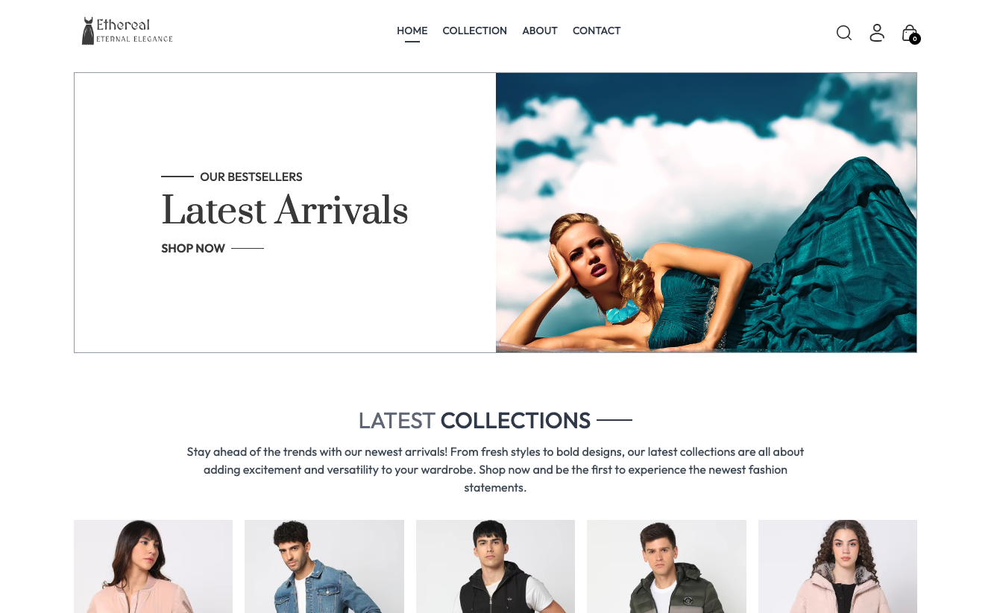
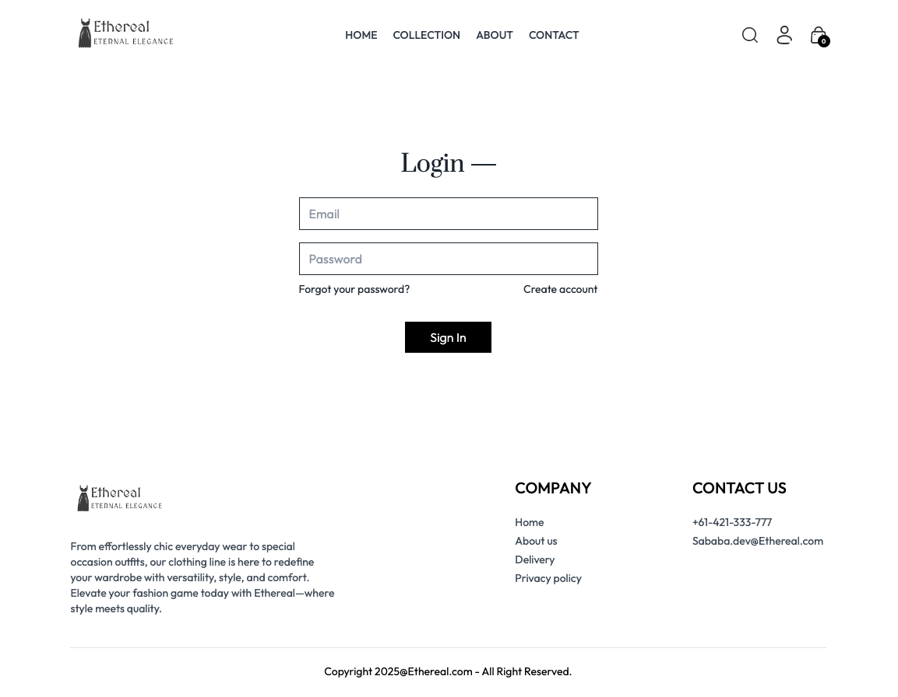
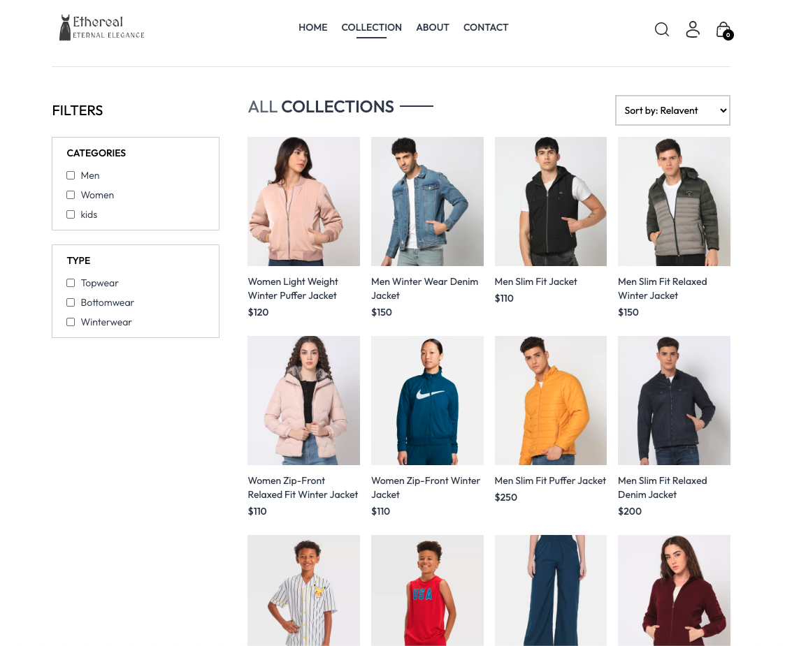
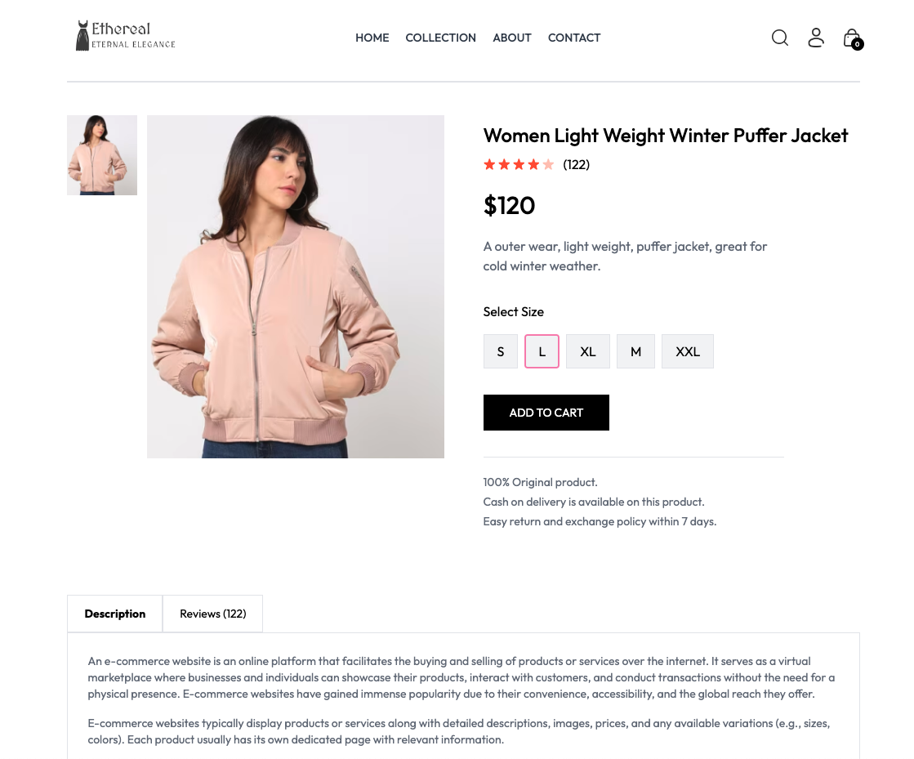
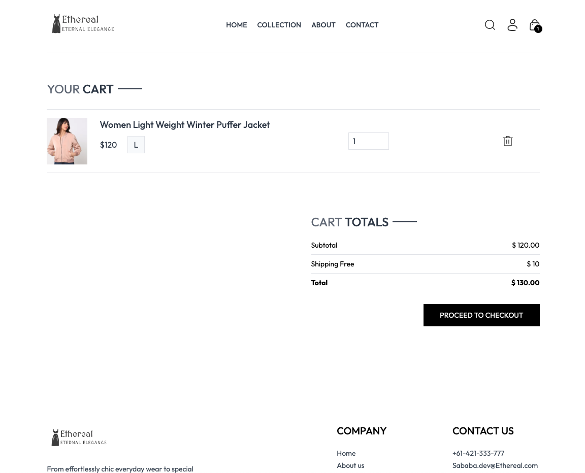
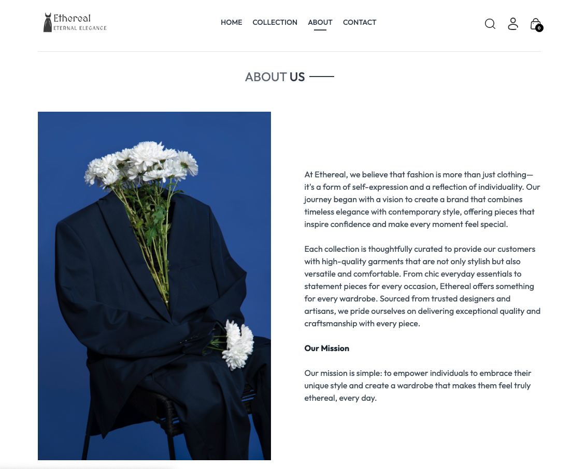

# Ethereal Apparel - E-Commerce Website

Ethereal Apparel is a modern and scalable e-commerce website built using the MERN stack (MongoDB, Express.js, React, and Node.js). This project showcases a full-stack single-page application (SPA) with a focus on user interaction, smooth UX, and real-time data handling.




## Technologies Used

-**Frontend:** React.js

-**Backend:** Node.js, Express.js

-**Database:** MongoDB with Mongoose ODM

-**Authentication:** JWT (JSON Web Tokens)

-**Deployment:** Render for full-stack deployment

-**Version Control:** GitHub for source code management

-**CI/CD:** itHub Actions for automated workflows


## Project Overview

This interactive and responsive e-commerce platform provides users with a seamless shopping experience. It offers authentication, a dynamic product catalog, a shopping cart, and a seemless payment and checkout process by stripe. All powered by a MongoDB backend. The website is fully deployed and functional, supporting various user operations like browsing, adding products to the cart, and managing user authentication securely with JWT.

## Key Features

-**Interactive UI:** Engaging and user-friendly interface that allows users to browse products, add them to the cart, and manage their profile.

-**User Authentication:** Users can register and log in with secure JWT authentication to personalize their shopping experience.

-**Product Management:** View and filter products whilst fetching real-time data from the MongoDB database.

-**Shopping Cart:** Users can add and remove products to/from their cart with instant updates.

-**Responsive Design:** Optimized for various screen sizes using Tailwind CSS, offering a mobile-first, responsive layout.

-**Image Hosting with Cloudinary:** Product images are uploaded and served via Cloudinary, providing fast and responsive image delivery.

-**Deployment:** Hosted on Render, ensuring high availability and scalability for all users.


## Deployed Application

## Live Demo
[Click here to view the live project](https://ecommerce-website-frontend-fnfh.onrender.com)

## backend deployment: 

[Click here to view ](https://ecommerce-website-backend-2sgz.onrender.com)


## Screenshots








## Project Structure

```
ethereal-apparel/
├── client/                    # React frontend
│   ├── public/                # Static files
│   ├── src/                   # React source files
│   │   ├── components/        # React components (UI elements, pages)
│   │   ├── App.js             # Main app component
│   │   └── index.js           # Entry point
├── server/                    # Express backend
│   ├── models/                # MongoDB models (User, Product, etc.)
│   ├── resolvers/             # GraphQL resolvers
│   ├── schemas/               # GraphQL schemas
│   ├── server.js              # Express server setup
│   └── utils/                 # Helper functions (authentication, JWT)
├── .env                       # Environment variables
├── package.json               # Backend dependencies
├── client/package.json        # Frontend dependencies
└── README.md                  # Project overview

```
## Contributing

-Fork the repository.

-Create a new branch (feature-branch-name).

-Commit your changes.

-Open a pull request.

## License

This project is licensed under the MIT License.

## Contact

For any inquiries, please reach out via email at sababa.dev@ethereal.com
